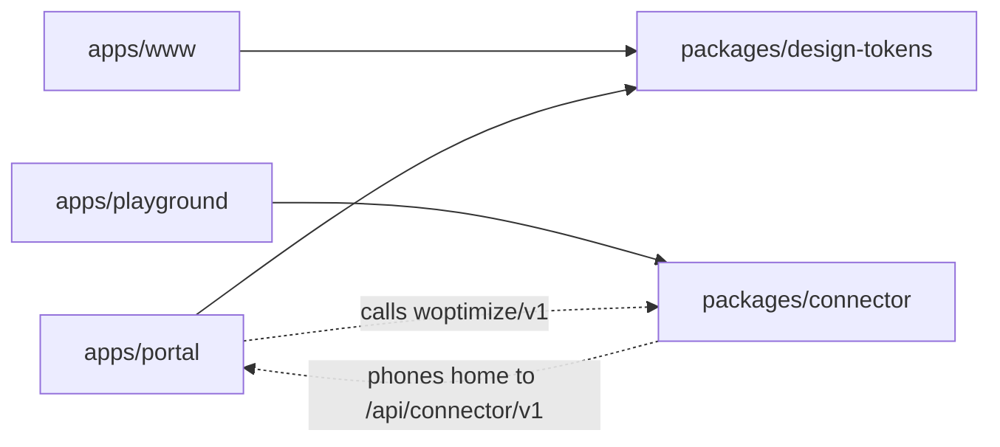
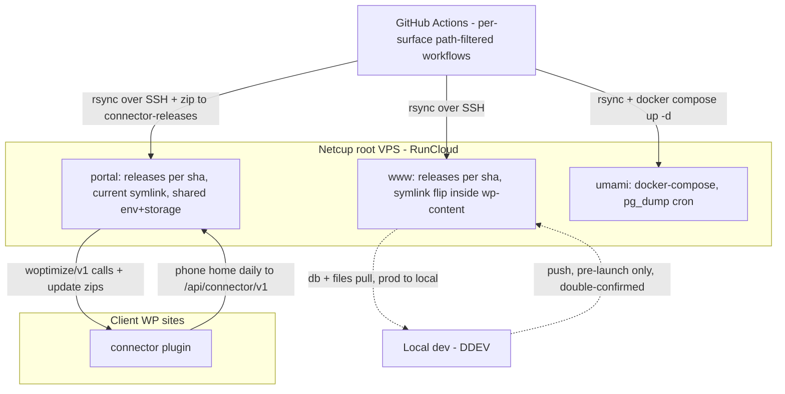

# Architecture Spine — woptimize.io

## Design Paradigm

**Multi-app monorepo: build-time sharing, runtime independence.**

- `apps/` are independently deployable products. Each fails alone, deploys alone, rolls back alone.
- `packages/` are build-time inputs only: `design-tokens` compiles **into** the apps; `connector` zips up **for** client sites. Nothing under `packages/` runs as a service.
- The **only** runtime coupling in the whole system is the versioned connector↔portal contract (both directions — AD-4).
- `infra/` describes deployments; it is never a codebase.

Dependency direction (solid = build-time, allowed; dashed = the one runtime contract; no other edges exist):



## Invariants & Rules

### AD-1 — One monorepo, sealed app borders `[ADOPTED]`

- **Binds:** all
- **Prevents:** copy-drift of tokens, a split plugin/portal contract, cross-app imports.
- **Rule:** All Woptimize code lives in this repo, laid out per the Structural Seed. An app never imports another app's code. Sharing happens only through `packages/` at build time or through the contract (AD-4) at runtime.

### AD-2 — One runtime coupling

- **Binds:** all apps
- **Prevents:** hidden coupling — shared databases, shared sessions, cross-app includes, portal reading WP tables.
- **Rule:** The only runtime link between any two Woptimize components is the connector↔portal contract defined in `openapi.yaml` (AD-4) — connector-hosted `woptimize/v1` routes and portal-hosted `/api/connector/v1/*` routes. Each app owns its own database.

### AD-3 — Token pipeline

- **Binds:** CAP-2, `packages/design-tokens`, both apps' styles
- **Prevents:** two token dialects; hand-edited or hand-copied style artifacts; two owners of `theme.json`; a deploy whose compiled CSS misses the tokens; unnamed filenames two builders resolve differently.
- **Rule:** One DTCG JSON (`$value`/`$type`) source in `packages/design-tokens` covers the full design language: fonts, colors, typography, spacing, motion, buttons, links (tokens + base styles — the envelope, no components). Style Dictionary builds exactly these artifacts, at exactly these paths, all gitignored, never hand-edited:
  - `apps/www/themes/woptimize-theme/theme.json` — **merged**: the theme owns a committed, hand-edited `theme.base.json` beside it; the token build injects the token sections (`settings.color`, `settings.typography`, `settings.spacing`, …) into it and emits `theme.json`. Tokens own the token sections; the theme owns everything else. One writer per section.
  - `apps/www/themes/woptimize-theme/assets/css/tokens.css` — custom properties + base styles for WP.
  - `apps/portal/resources/css/tokens.theme.css` — the Tailwind 4 `@theme` file (supersedes the spec's v3-era "Tailwind preset" wording).
  - `apps/portal/resources/css/tokens.base.css` — base styles for Laravel. The portal's own `app.css` and Tailwind setup stay the portal's.
  One command builds everything: root `npm run tokens:build`. It is **always the first build step** — before any app asset compile, locally and in CI. Per-app setup runs it once; every deploy job runs it before compiling assets.

### AD-4 — Contract-first, CI-enforced, both directions

- **Binds:** CAP-3, CAP-6, `packages/connector`, `apps/portal`
- **Prevents:** portal and connector implementing different shapes; a portal-hosted half of the contract that lives only in code; silent contract drift.
- **Rule:** `packages/connector/openapi.yaml` (OpenAPI 3.1) is the single source of truth for **both directions** of the contract: the connector-hosted endpoints (the client site's `woptimize/v1` REST base) and the portal-hosted endpoints the connector calls (`/api/connector/v1/*` — phone-home, update check, zip download, onboarding). A contract change edits the YAML **before** code, both directions in the same PR. The CI integration suite validates **both** the connector's and the portal's real responses against the file. No client/server code generation.

### AD-5 — Contract conventions

- **Binds:** CAP-3, every contract endpoint on both sides
- **Prevents:** ad-hoc auth schemes; endpoints outside the versioned namespaces; breaking changes hiding inside `v1`; two version-reporting dialects.
- **Rule:** Connector-hosted endpoints live under `woptimize/v1`; portal-hosted contract endpoints live under `/api/connector/v1/`. Changes inside `v1` are additive only on both sides (`v2` is a major event). The site key travels in the `X-Woptimize-Site-Key` header in both directions and is compared with `hash_equals()`. The connector reports its version in the `X-Woptimize-Connector-Version` response header and in the phone-home body — never in ad-hoc body fields.

### AD-6 — One writer per fact

- **Binds:** CAP-3, portal DB, connector storage
- **Prevents:** two owners of one entity; offboarded sites re-registering themselves; the portal guessing REST URLs that real WP installs break.
- **Rule:** The portal owns the site registry: site URL, the connector-reported REST base URL, site key, installed connector version, last-seen. Registry rows are created **only** by explicit portal-side onboarding — a call with an unknown or invalid key gets a side-effect-free `401` (no row, rate-limited logging). The portal never constructs endpoint URLs from the site URL; it calls the REST base the connector reported via `rest_url('woptimize/v1')` in its phone-home. The connector owns nothing durable except its settings and its cached copy of the portal-issued key in `wp_options`. No fact has two writers.

### AD-7 — The no-op invariant

- **Binds:** CAP-3, `packages/connector`
- **Prevents:** a Woptimize failure breaking a client's production site; retry storms; license logic creeping in.
- **Rule:** The connector never breaks a client site. Every remote failure degrades to a silent no-op. Any `4xx` is **permanent-quiet**: stay silent until the next regular WP-Cron slot, never tighten the schedule. Only `5xx`/network errors may retry, at most once per cron slot. No fatals, no admin-notice spam. There is **no license system anywhere** — the update endpoints perform no license validation; offboarding is uninstall, and an orphaned connector no-ops forever.

### AD-8 — Karin's rule `[ADOPTED]`

- **Binds:** CAP-3, CAP-6, connector + portal releases
- **Prevents:** lockstep releases; a portal deploy stranding not-yet-updated client sites.
- **Rule:** The portal supports the current **and previous** connector minor version. Patch releases never change the contract. A contract change requires a minor (or major) bump; the connector ships first, the portal after.

### AD-9 — One deploy model

- **Binds:** CAP-4, CAP-5, www + portal deploy jobs
- **Prevents:** two deploy mental models in one repo; a portal with no rollback; a www flip mechanism invented per-story; theme/plugin slugs chosen twice (which the CAP-7 DB sync then breaks).
- **Rule:** Both apps deploy as immutable `releases/<sha>` + a symlink flip; rollback = flip back, code only. Deploys trigger only via per-app path filters — no raw RunCloud webhooks.
  - **www:** a release contains `themes/`, `plugins/`, and the built token artifacts. The flip happens **inside `wp-content/`**: `wp-content/themes/woptimize-theme` and `wp-content/plugins/woptimize-core` are symlinks repointed to the new `releases/<sha>/`. Slugs are fixed everywhere (local symlinks, server, DB): theme `woptimize-theme`, site plugin `woptimize-core`. A future child theme adds its own folder under `themes/` and its own symlink — same pattern. Persistent and never in a release: `uploads/`, WP core (managed via panel per AD-12).
  - **portal:** CI builds (composer + `tokens:build` + assets); `.env` and `storage/` live in `shared/`, symlinked per release; `migrate --force` runs before the flip; the RunCloud web root points at `current/public`.

### AD-10 — Expand/contract migrations

- **Binds:** `apps/portal` migrations
- **Prevents:** a migration that strands rollback.
- **Rule:** Every portal migration stays compatible with the previous release (expand/contract). A symlink rollback must always be safe without a DB restore.

### AD-11 — One test suite, one command, two venues

- **Binds:** CAP-3, CAP-6, `apps/playground`, CI
- **Prevents:** unguarded contract drift; a CI-only test environment that drifts from local; a portal deploy flipping while the contract suite fails elsewhere; a first release blocked by a matrix leg that cannot exist.
- **Rule:** The connector integration suite runs with one command (`ddev exec …`) against `apps/playground` — identical locally and in CI (CI reuses the same `.ddev` configs via `ddev/github-action-setup-ddev`). The suite is a **reusable workflow** (`workflow_call`) invoked by both `connector.yml` and `portal.yml`; the portal deploy job declares `needs:` on it — no portal deploy without a green suite in the same run. The suite includes:
  - the Karin's-rule matrix: portal against the connector's current **and** previous minor. The N-1 leg validates against the `openapi.yaml` **at tag `plugin-v<previous-minor>`**; HEAD's YAML governs only the current leg. When no previous minor tag exists (first release, first minor after a major), the N-1 leg is skipped and reported as skipped, not failed.
  - the AD-7 scenarios: bad key, unreachable portal, offboarded site — each must produce a silent no-op.
  - the connector leg runs at the client floor (PHP 8.1 — see Stack).

### AD-12 — Panel or pipeline, never ad-hoc SSH

- **Binds:** the production VPS
- **Prevents:** snowflake server state nobody can replicate.
- **Rule:** Every production server change comes from the RunCloud panel (app setup, PHP version, SSL, cron) or from a CI pipeline (a script in git). Never ad-hoc SSH. This includes umami: changes to `infra/umami` deploy via `umami.yml` (rsync + `docker compose up -d` over SSH) — Docker merely runs there; its state still arrives through the pipeline.

### AD-13 — Secrets placement

- **Binds:** CI, all deploy jobs
- **Prevents:** runtime secrets in the repo or CI logs; secret collisions in a flat namespace.
- **Rule:** Deploy credentials live in repo-level GitHub Actions secrets, prefixed per app (`WWW_`, `PORTAL_`, `UMAMI_`) — the free plan has no environments. Naming scheme: `<APP>_SSH_HOST`, `<APP>_SSH_USER`, `<APP>_SSH_KEY`, `<APP>_DEPLOY_PATH`. Runtime secrets (`.env`, WP salts) live only on the server in `shared/`.

### AD-14 — Backup ownership

- **Binds:** the DB-and-uploads half of rollback (spec constraint)
- **Prevents:** data with no backup owner — especially Umami's Postgres, invisible inside Docker.
- **Rule:** RunCloud Backup covers www and portal, files and databases, on a schedule with an offsite destination. A `pg_dump` cron in `infra/umami` writes into a RunCloud-backed folder. WP Umbrella is an extra layer on www.

### AD-15 — The idiom border

- **Binds:** all code
- **Prevents:** a home-grown convention layer smeared across the WP/Laravel border.
- **Rule:** Each app keeps its own framework's idioms and tooling (see Consistency Conventions). Nothing crosses the border except tokens and the contract.

### AD-16 — Key lifecycle

- **Binds:** CAP-3, onboarding, `apps/portal`, `packages/connector`
- **Prevents:** two complete builds in which each side waits for a key the other never sends; unspecified key format and storage.
- **Rule:** The **portal issues** every site key at onboarding: the portal UI creates the site record + key; a human pastes the key into the connector's settings screen (v1). The connector **never** generates, derives, or changes a key — its `wp_options` copy is a cache of a portal-issued fact. Key format: 40-character random alphanumeric. The portal stores keys encrypted at rest (Laravel encrypted cast) but retrievable — the key is a bearer credential used in both directions. Rotation: the portal issues a replacement and invalidates the old one; a connector holding a dead key gets `401` and no-ops (AD-7) until rekeyed by manual re-paste. Any onboarding/verification endpoint lives in `openapi.yaml` (AD-4).

### AD-17 — Update delivery

- **Binds:** CAP-6, `connector.yml`, `apps/portal`, `packages/connector`
- **Prevents:** three builders inventing three halves of one pipeline; a zip whose inner folder installs a duplicate deactivated plugin on client sites; no findable "previous minor".
- **Rule:** The connector's slug is fixed everywhere: folder `woptimize-connector/`, main file `woptimize-connector.php`; the contents of `packages/connector/` **are** the plugin folder's contents. On a `plugin-v*` tag, `connector.yml` builds `woptimize-connector-<semver>.zip` (inner folder `woptimize-connector/`) and rsyncs it to the portal's `shared/storage/connector-releases/` — which survives release flips (AD-9). The portal scans that folder; "latest" is the highest semver present; history is retained (the AD-11 matrix needs it). The portal serves the update-check and zip-download endpoints defined in `openapi.yaml`; the connector integrates via WordPress's `Update URI:` plugin-header mechanism pointed at the portal, authenticated with the site key (AD-5).

### AD-18 — The playground contract

- **Binds:** CAP-3, CAP-6, AD-11, `apps/playground`, `apps/portal`
- **Prevents:** the suite's two users imagining different playground states; tests that only pass on a hand-glued local setup.
- **Rule:** `apps/playground` is its **own DDEV project** and mirrors the www layout rules (WP install gitignored) minus the theme. One committed DDEV command, `ddev playground-setup`, produces its entire test state: installs WP (PHP at the connector floor), symlinks `packages/connector` into `wp-content/plugins/woptimize-connector`, activates it, and sets the fixture site key from `WOPTIMIZE_TEST_SITE_KEY` (fixed default in `.ddev` config). `apps/portal` is also a DDEV project; the suite starts both — playground at `https://playground.ddev.site`, portal at `https://portal.ddev.site` — and the portal tests read the same fixture-key variable. Nothing about the test state is set up by hand.

### AD-19 — Minimum observability

- **Binds:** operations, all deployed surfaces
- **Prevents:** a dead portal, failed deploy, or silent client site that nobody notices.
- **Rule:** Uptime: WP Umbrella watches www; one external uptime check watches the portal and umami. Errors: Laravel logs at `shared/storage/logs`, WP debug log at a fixed path — both inside RunCloud backup scope. Deploy failures: GitHub Actions failure notifications. Client-site health: the registry's `last-seen` (AD-6) is the signal — a stale row means a site stopped phoning home. No further tooling until this floor proves too small.

## Consistency Conventions

| Concern | Convention |
| --- | --- |
| CI workflows | One workflow per **deployable surface**: `www.yml`, `portal.yml`, `connector.yml`, `umami.yml`. `design-tokens` has none — it rides inside the app workflows. |
| CI path filters | Each workflow triggers on its own path **plus every `packages/` path it consumes**: `www.yml` + `portal.yml` also on `packages/design-tokens/**`; `connector.yml` on `packages/connector/**` + `apps/portal/**`; `umami.yml` on `infra/umami/**`. |
| Secrets naming | Repo-level, app-prefixed: `<APP>_SSH_HOST`, `<APP>_SSH_USER`, `<APP>_SSH_KEY`, `<APP>_DEPLOY_PATH` |
| Token format | DTCG `$value`/`$type` JSON; artifact paths and filenames are fixed in AD-3, never by consumers |
| API shapes | Defined in `openapi.yaml` only, both directions in the same PR — never invented in code first |
| Error envelopes | Connector-hosted endpoints: the WP core REST error shape (`code`, `message`, `data.status`) — never a custom one (WP core emits it before plugin code runs). Portal-hosted endpoints: Laravel's default JSON error shape. |
| Auth | `X-Woptimize-Site-Key` header both directions; `hash_equals()` comparison |
| State | One writer per fact (AD-6); remote failure → no-op (AD-7); migrations expand/contract (AD-10) |
| Content sync | `prod.yaml` pulls routinely; **push is pre-launch only** and carries a double confirmation — DDEV's own confirm plus a typed-production-hostname guard inside the provider's push commands. After launch, content flows one way: production → local. |
| Node & PHP layout | npm; independent `package.json` per unit, no workspaces; one root `package.json` holds only cross-cutting scripts (`tokens:build`). Composer: per-app `composer.json`, no root. |
| Portal tests & style | Pest; Laravel Pint |
| WP tests & style (theme, site plugin, connector) | PHPUnit; WordPress Coding Standards via PHPCS |
| Versioning | Connector: semver, `plugin-v*` tags, Karin's rule (AD-8). Contract namespaces: `woptimize/v1` (connector-hosted), `/api/connector/v1/` (portal-hosted) |

## Stack

| Name | Version |
| --- | --- |
| PHP (own apps) | 8.4 |
| Connector floor (client sites) | PHP ≥ 8.1, WP ≥ 6.7 — connector code uses no PHP 8.2+ syntax; CI tests this leg at 8.1 |
| Laravel | 13 |
| WordPress (own apps) | 7.1 |
| Node.js | 24 LTS |
| Tailwind CSS | 4.3 |
| Style Dictionary | 5.5 |
| MariaDB | as provisioned by RunCloud — write the major here at provisioning; all DDEV configs mirror it |
| OpenAPI | 3.1 |
| DDEV | pinned via `ddev/github-action-setup-ddev` version input; bumped deliberately |
| CI / hosting | GitHub Actions · Netcup root VPS · RunCloud |

## Structural Seed

```text
woptimize/
  apps/
    www/                  # WP marketing site
      themes/             # plural — room for a future child theme
        woptimize-theme/  # the custom theme (slug: woptimize-theme)
                          #   theme.base.json committed (theme-owned); theme.json + assets/css/tokens.css BUILT (AD-3)
      plugins/
        woptimize-core/   # the one site plugin (slug: woptimize-core)
      wordpress/          # full WP install, gitignored; per-item RELATIVE symlinks:
                          #   wp-content/themes/woptimize-theme -> ../../../themes/woptimize-theme
                          #   wp-content/plugins/woptimize-core -> ../../../plugins/woptimize-core
      .ddev/              # DDEV project root; docroot: wordpress
                          #   providers/prod.yaml = content sync: pull routinely, push pre-launch only, double-confirmed (CAP-7)
    portal/               # Laravel 13 client portal; own .ddev; tokens.theme.css + tokens.base.css BUILT into resources/css
    playground/           # throwaway WP client site; own .ddev; state built by `ddev playground-setup` (AD-18)
  packages/
    design-tokens/        # DTCG source + Style Dictionary config; built via root `npm run tokens:build`
    connector/            # contents = the woptimize-connector plugin folder; openapi.yaml = the contract (AD-4)
  infra/
    umami/                # docker-compose + env + pg_dump cron; deployed via umami.yml; never a codebase
  .github/
    workflows/            # www.yml, portal.yml, connector.yml, umami.yml + the reusable contract-suite workflow (AD-11)
```

Deployment & environments — production + local only, no staging (see Deferred):



## Capability → Architecture Map

| Capability | Lives in | Governed by |
| --- | --- | --- |
| CAP-1 monorepo | whole tree | AD-1, paradigm |
| CAP-2 token pipeline | `packages/design-tokens` → both apps | AD-3 |
| CAP-3 connector ↔ portal | `packages/connector`, `apps/portal` | AD-4, AD-5, AD-6, AD-7, AD-16 |
| CAP-4 path-filtered deploys | `.github/workflows/` | AD-9, AD-12, AD-13, CI conventions |
| CAP-5 www releases + rollback | www deploy job | AD-9, AD-14 |
| CAP-6 connector releases | `connector.yml`, portal update endpoints | AD-17, AD-8, AD-11 |
| CAP-7 content sync | `apps/www/.ddev/providers/prod.yaml` | content-sync convention (pull routine, push pre-launch double-confirmed, one-way after launch) |

## Deferred

- **Staging environment** — none for now. Revisit: the first migration that scares you, or when portal client-data risk grows.
- **Portal internal architecture** (layering, modules, queues) — feature-altitude decisions; a lower spine when portal features are specced.
- **Shared UI components** — only when both apps need the same component (Tomas's rule, spec non-goal).
- **OpenAPI validator library** — the build story picks one that supports the pinned spec version. Caution: several popular PHP validators (e.g. `league/openapi-psr7-validator`) support only 3.0.x; if no maintained 3.1 validator fits, write the contract 3.0.3-compatible instead — a build-story call.
- **Key-rotation delivery automation** — manual re-paste in v1 (AD-16); automate only when rotation becomes routine.
- **Phone-home cadence** — config, currently daily via WP-Cron + activation/self-update pings; tune anytime.
- **Node 26 LTS bump** — when it enters Active LTS (October 2026).
- **PHP 8.5 bump for own apps** — plan during 2027; PHP 8.4 active support ends Dec 2026 (security fixes to Dec 2028).
- **Observability beyond the AD-19 floor** (APM, log aggregation) — when the floor proves too small.
- **Umami public exposure** (subdomain, reverse proxy) — build story, contained in `infra/umami`.
- **CI internals** (caching, concurrency groups) — readable off the workflow files once they exist.
